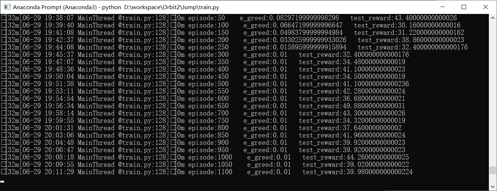

# Reinforcement-Learning
百度paddlepaddle+parl+Jump

一、环境  
1.框架  
pip uninstall -y pandas scikit-learn   
pip install paddlepaddle==1.6.3 -i  http://mirrors.aliyun.com/pypi/simple/ --trusted-host mirrors.aliyun.com  
pip install parl==1.3.1 -i  http://mirrors.aliyun.com/pypi/simple/ --trusted-host mirrors.aliyun.com  
pip install gym  
2.游戏代码库：  
Jump代码库：https://github.com/shivaverma/Orbit 

二、代码说明  
1.算法  
用到parl框架里面的DQN算法  
2.框架的套用  
主要是和环境交互的部分要修改下才能用：  
obs,action这两个部分  
三、运行结果  
1.reward 50+

